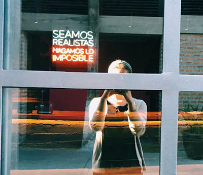

# Hello there!👋
## About me 👩‍💻
My name is Sonia Reyes, and I have always been passionate about building things with my hands and mind. I love the process of connecting the dots between the things you envision and working towards the final product. 

I am a Front End Developer Jr and Master in Business Administration, working mostly with **JavaScript, React, HTML5, and CSS3** 🤖 I enjoy contributing to projects, with a broad vision that seeks to create and improve user experience.

  

📖 Outside of the world of tech, you´d find me reading (especially historical fiction), and listening to podcasts. Personal favs: [Ologies Pod](https://open.spotify.com/show/5nvRkVMH58SelKZYZFZx1S?si=7b1609ed86444872), a comedic science show; and [Ancient Heroes](https://open.spotify.com/show/2nG2kJlK7gbrCJO31KnvrT?si=b043fec1f6554e13), about myths of the ancient world. 

## Tech Stack 🚀

## Reach Out 👋

